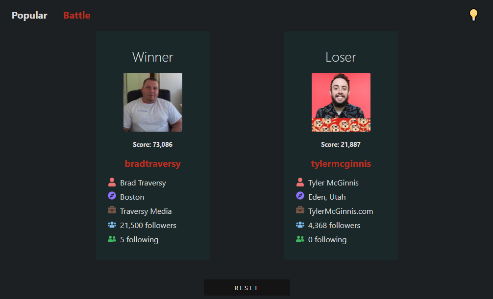
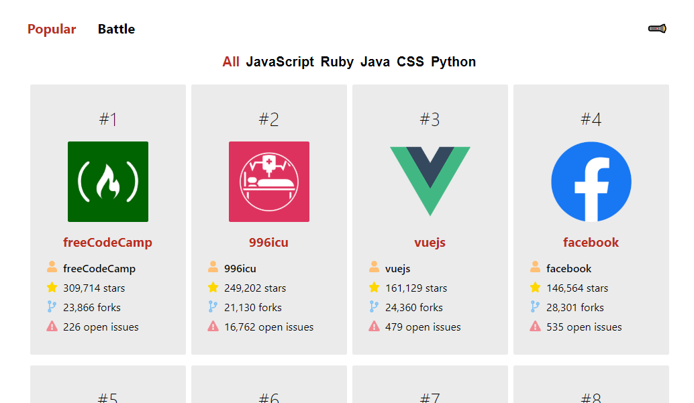

## Github Battle Project

My first project build with React! I followed along with Tyler McGinnis' React course and learned React with Hooks (class based). I learned about the React ecosystem, implementing Webpack, JSX, props and propTypes, React Router, rendering lists, managing state, functional components, the component lifecycle, composition with children, higher order components, code splitting and much more.

This React project uses the Github API to show the top accounts. You can view all in one list or view them by programming language. When you go to the battle page you can enter two Github users and they will battle based on a defined formula to determine a winner.

